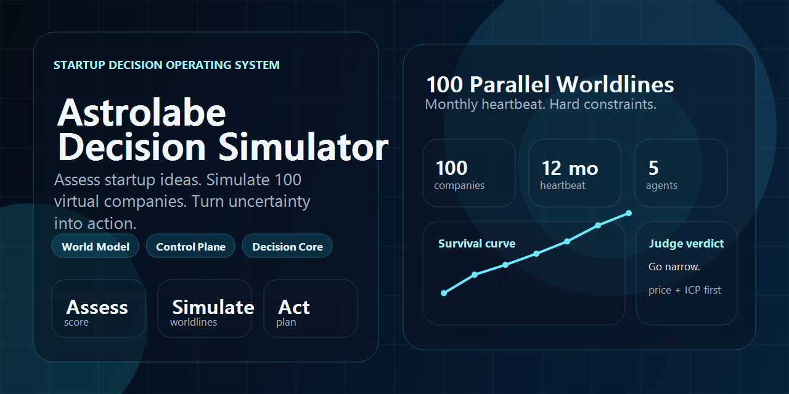
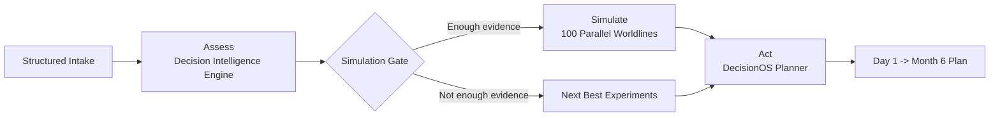

<p align="center">
  
</p>

<h1 align="center">Astrolabe Decision Simulator</h1>

<p align="center">
  <strong>Assess startup ideas. Simulate 100 virtual companies. Turn uncertainty into action.</strong>
</p>

<p align="center">
  Built for AI founders, solo operators, and 2-10 person teams.
</p>

## What This Is

Astrolabe Decision Simulator is not a generic startup copilot and not a business-plan generator.

It is a constrained decision system that answers three questions in order:

1. Is this idea worth doing now?
2. If we do it, how does it evolve across 100 parallel worldlines?
3. What is the next lowest-cost experiment or action that materially improves the odds?

## Core Loop

| Layer | What it does | Main outputs |
| --- | --- | --- |
| `Assess` | Converts founder input, evidence, and constraints into a structured scenario. | Viability score, data sufficiency, confidence, risks, leverage points |
| `Simulate` | Runs 100 virtual companies that share the same idea but vary on founder type, pricing, channel, automation, and market noise. | Survival rates, profitability paths, death reasons, best strategy patterns |
| `Act` | Turns assessment and simulation outcomes into staged execution guidance. | Next Best Experiments, Day 1 -> Month 6 plan, stop-loss rules |

## Why It Matters

- Startup teams do not fail because they lack opinions. They fail because they make expensive moves under weak evidence.
- Most tools help with brainstorming. Very few force hard constraints like budget, runway, founder energy, and delivery capacity into the loop.
- Astrolabe Decision Simulator is designed to compress uncertainty into a system with state, rules, replay, and action sequencing.

## Architecture At A Glance

This repository combines three internal architecture layers into one system:

- `World Model`: world modeling -> role generation -> simulation -> report
- `Control Plane`: org chart, heartbeat scheduling, budget constraints, audit logs, multi-company isolation
- `Decision Core`: decision engine, scoring, data sufficiency, confidence, feedback loop, Next Best Experiment

The core differentiation is `100 parallel virtual company simulations` for the same startup idea under hard business constraints.



## System Primitives

### Fixed Agents Per Company

- `Founder Agent`: pricing, channels, hiring, product priorities, pivot decisions
- `Market Agent`: leads, conversion, churn, demand shifts, price sensitivity
- `Operations Agent`: capacity, backlog, quality, support load, founder overload
- `Finance Agent`: revenue, cost, profit, cash, runway, death conditions
- `Judge Agent`: stage labels, causal explanations, audit log, replay summaries

### Hard Constraints

- cash balance
- runway
- founder energy
- delivery capacity
- CAC and payback logic
- marketing budget
- hiring overhead

### State-Driven Simulation

This is not free-form multi-agent chat.

Each company evolves through explicit monthly heartbeats:

1. Founder decides
2. Market reacts
3. Operations absorbs the consequence
4. Finance settles the month
5. Judge records the causal chain

## Repository Map

```text
.
|-- apps/
|   |-- api/   # FastAPI backend, Alembic migrations, assessment and simulation services
|   `-- web/   # Next.js frontend for intake, report, planner, simulation, and replay
|-- .github/
|   `-- assets/  # GitHub-facing visual assets including the social preview
`-- README.md
```

## Local Development

### Web

```bash
cd apps/web
npm install
npm run dev
```

### API

```bash
cd apps/api
python -m venv .venv
.venv\Scripts\activate
pip install -e .[dev]
copy .env.example .env
alembic upgrade head
uvicorn decision_os_backend.main:app --reload --app-dir src
```

Optional demo seed:

```bash
cd apps/api
python scripts/seed_demo.py
```

## Current Product Surface

### Frontend

- Scenario intake
- Assessment report
- Planner page
- Simulation overview
- Single-company replay page
- Landing page aligned to the Assess -> Simulate -> Act narrative

### Backend

- FastAPI API
- PostgreSQL persistence
- Alembic migrations
- Rule-based assessment engine
- State-driven simulation engine
- Planner service
- Demo seed script

## Intended Output

For each startup idea, the system is designed to produce:

- structured project summary
- viability score and 8-dimension scoring
- data sufficiency score
- confidence score
- top risks and top leverage points
- 1 / 6 / 12 / 24 month survival rates
- profitability path and death-reason distribution
- best strategy path
- best founder profile fit
- top three Next Best Experiments
- phase-based plan for Day 1, Week 1, Month 1, Month 3, Month 6

## Status

The main loop is already visible end-to-end:

- intake -> assessment
- assessment -> simulation
- simulation -> planner
- planner / report / simulation -> frontend rendering

The next layer of work is increasing realism, explainability, and replay depth.
