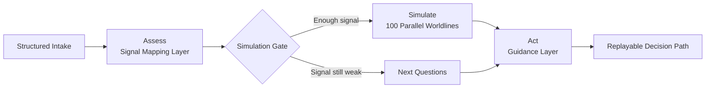

<p align="center">
  
</p>

<h1 align="center">Astrolabe Decision Simulator</h1>

<p align="center">
  <strong>Assess symbolic signals. Simulate 100 worldlines. Turn uncertainty into action.</strong>
</p>

<p align="center">
  Built for astrologers, symbolic practitioners, and curious decision-makers who want replayable scenario analysis.
</p>

## What This Is

Astrolabe Decision Simulator is not a generic horoscope chatbot and not a static chart viewer.

It is a structured decision simulator designed to answer three questions in order:

1. What does this question look like when the signals are made explicit?
2. How do 100 parallel worldlines evolve under different symbolic assumptions?
3. What is the next action, timing window, or question worth testing?

## Core Loop

| Layer | What it does | Main outputs |
| --- | --- | --- |
| `Assess` | Converts chart notes, symbolic evidence, and constraints into a structured scenario. | Signal map, confidence, key tensions, leverage points |
| `Simulate` | Runs 100 symbolic worldlines that vary by archetype emphasis, timing bias, and interpretation path. | Survival curves, path divergence, failure patterns, best-fit trajectories |
| `Act` | Turns the simulation into practical guidance and replayable next steps. | Timing notes, next questions, action paths, stop-loss logic |

## Why It Matters

- Most astrology tools stop at interpretation. They do not compare alternative paths under constraints.
- Real decisions are rarely blocked by lack of symbolism. They are blocked by messy signals, competing interpretations, and no replayable decision structure.
- Astrolabe Decision Simulator is built to compress symbolic uncertainty into something you can inspect, compare, and act on.

## Architecture At A Glance

This repository combines three system ideas into one product:

- `World modeling`: turn symbolic inputs into a scenario the engine can reason about
- `Worldline simulation`: explore 100 constrained branches instead of one linear interpretation
- `Replay + planning`: turn outcomes into explanations, next actions, and timing-sensitive guidance

The core differentiation is `100 parallel worldline simulations` for the same question rather than a single static reading.



## System Primitives

### Core Layers

- `Signal Mapping`: transforms the question, context, and chart interpretation into explicit inputs
- `Worldline Engine`: branches the same scenario into multiple constrained symbolic paths
- `Judge Layer`: explains why a path strengthens, stalls, or collapses
- `Guidance Layer`: turns outcomes into practical next steps

### Hard Constraints

- timing windows
- interpretation confidence
- conflicting signals
- path dependency
- decision cost
- replayability

### State-Driven Simulation

This is not free-form chat.

Each worldline moves through explicit heartbeat cycles so the replay stays causal instead of purely narrative.

## Repository Map

```text
.
|-- apps/
|   |-- api/   # FastAPI backend, Alembic migrations, assessment and simulation services
|   `-- web/   # Next.js frontend for intake, report, planner, simulation, and replay
|-- .github/
|   `-- assets/  # GitHub-facing visual assets including the social preview
`-- README.md
```

## Local Development

### Web

```bash
cd apps/web
npm install
npm run dev
```

### API

```bash
cd apps/api
python -m venv .venv
.venv\Scripts\activate
pip install -e .[dev]
copy .env.example .env
alembic upgrade head
uvicorn decision_os_backend.main:app --reload --app-dir src
```

Optional demo seed:

```bash
cd apps/api
python scripts/seed_demo.py
```

## Current Product Surface

### Frontend

- Structured intake
- Decision report
- Planner page
- Simulation overview
- Single-worldline replay page
- Landing page aligned to the Assess -> Simulate -> Act narrative

### Backend

- FastAPI API
- PostgreSQL persistence
- Alembic migrations
- Rule-based assessment engine
- State-driven simulation engine
- Planner service
- Demo seed script

## Intended Output

For each decision scenario, the system is designed to produce:

- structured scenario summary
- signal confidence and evidence posture
- risk and leverage map
- 1 / 6 / 12 / 24 cycle worldline behavior
- path divergence and failure-pattern distribution
- best-fit trajectory
- top next questions
- phase-based action plan

## Status

The main loop is already visible end-to-end:

- intake -> assessment
- assessment -> simulation
- simulation -> planner
- planner / report / simulation -> frontend rendering

The next layer of work is increasing realism, explainability, and replay depth.
